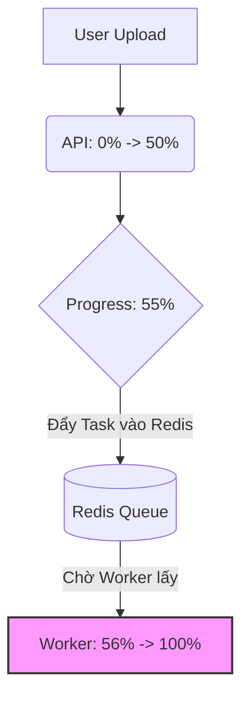

Edited readme.md
Viewed readme.md:1-25
Searched for "55"
Searched for "progress"
Searched for "55"
Viewed worker.py:1-800
Viewed progress.py:1-24
Searched for "caption_images_task"
Viewed worker.py:800-1053

Để giải quyết vấn đề tài liệu tải lên bị dừng (stuck) ở đúng **55%**, chúng tôi đã thực hiện một phiên làm việc phối hợp giữa các vai trò trong đội ngũ phát triển phần mềm (Analyst, Architect, Dev, QA) để phân tích mã nguồn và đưa ra chẩn đoán chính xác nhất cho bạn.

---

### 🕵️‍♂️ 1. System Analyst (Phân tích nghiệp vụ & Hành vi)
Khi bạn thực hiện upload tài liệu, hệ thống chia tiến trình xử lý tài liệu (Ingestion Pipeline) thành các giai đoạn rõ rệt dựa trên phần trăm tiến độ lưu trong cơ sở dữ liệu:
*   **0% - 50%**: Giai đoạn **Pre-processing** (Tải file từ MinIO, trích xuất text, trích xuất hình ảnh thô, xây dựng layout outline).
*   **Đúng 55%**: Điểm đồng bộ hóa (Synchronization Point) nơi hệ thống chuẩn bị đẩy tác vụ nặng sang hàng đợi (Redis Queue) để biên dịch sang Wiki Page bằng LLM.
*   **> 55% (từ 56% trở đi)**: Giai đoạn **Compilation & Extraction** (Map-Reduce bằng LLM để tạo Wiki Page).

> **Kết luận**: Việc tiến độ dừng lại chính xác ở **55%** và trạng thái vẫn là `processing` (không chuyển sang `error`) chứng tỏ giai đoạn **Pre-processing đã hoàn thành thành công**, và tác vụ đã được đẩy vào hàng đợi Redis. Tuy nhiên, tác vụ tiếp theo **chưa bao giờ được thực hiện hoặc chưa có worker nào xử lý**.

---

### 📐 2. Software Architect (Kiến trúc hệ thống)
Hệ thống Arkon sử dụng thư viện **arq** (Async Redis Queue) để xử lý các tác vụ nền. Khi chạy trên Docker, mô hình phân rã dịch vụ gồm:
1.  `arkon_api` (API): Nhận file, lưu vào MinIO, xử lý tiền xử lý ban đầu lên đến 55%, sau đó đẩy job vào Redis.
2.  `arkon_redis` (Redis): Hàng đợi chứa các job.
3.  `arkon_worker` (Worker): Đọc job từ Redis, xử lý Map-Reduce LLM (từ 56% đến 80%).

Sơ đồ hoạt động tại mốc 55%:


---

### 💻 3. Lead Developer (Phân tích mã nguồn)
Trong file [app/worker.py](file:///Volumes/Data/101.AI/GitHub/arkon/app/worker.py#L144-L162), mã nguồn xử lý mốc 55% như sau:

```python
# --- Step 6: Enqueue captioning (if images) OR MRP directly ---
await tracker.update(55, "Queuing compilation pipeline...")
pool = await get_arq_pool()
if images:
    job = await pool.enqueue_job("caption_images_task", source_id)
    source.progress_message = f"Captioning {len(images)} images before extraction..."
else:
    job = await pool.enqueue_job("ingest_map_reduce_task", source_id)
    source.progress_message = "Extraction queued..."
source.status = "processing"
source.progress = 55
await session.commit()
```

Khi Worker nhận được tác vụ `ingest_map_reduce_task`, dòng đầu tiên nó chạy sẽ là:
```python
source.status = "processing"
source.progress = 56
source.progress_message = "Extracting knowledge from document..."
```

**Nguyên nhân kỹ thuật chính**: Vì tiến độ bị dừng ở **55%**, có nghĩa là `pool.enqueue_job` đã chạy xong, nhưng dòng code cập nhật tiến độ lên `56%` của Worker **chưa bao giờ được thực thi**. Điều này xảy ra do **dịch vụ Worker chưa hoạt động hoặc bị lỗi kết nối với Redis**.

---

### 🧪 4. QA Engineer (Quy trình kiểm tra & Khắc phục)

Để giải quyết triệt để lỗi này, bạn hãy kiểm tra các cấu hình và dịch vụ còn thiếu theo checklist sau:

#### Bước 1: Kiểm tra xem container Worker đã chạy hay chưa
Thông thường khi chạy Docker, người dùng chỉ khởi động frontend/backend mà quên khởi động worker.
Hãy chạy lệnh sau trên máy host của bạn:
```bash
docker compose ps
```
*   **Yêu cầu**: Cả hai container `arkon_worker` và `arkon_worker_skills` phải ở trạng thái `running` (Up).
*   **Khắc phục**: Nếu chưa chạy, hãy khởi động toàn bộ dịch vụ bằng lệnh:
    ```bash
    docker compose up -d
    ```

#### Bước 2: Kiểm tra cấu hình AI Providers (LLM & Embeddings)
Ngay sau mốc 55%, worker sẽ gọi API đến mô hình ngôn ngữ (LLM) và mô hình nhúng (Embeddings) để phân tích tài liệu. Nếu bạn chưa cấu hình khóa API hoặc cấu hình sai:
1. Đăng nhập vào trang Frontend bằng tài khoản mặc định (`admin@arkon.local` / `admin123`).
2. Truy cập vào **Admin Portal** -> **Settings**.
3. Điền đầy đủ thông tin khóa API và chọn:
   * **Embedding model** (bắt buộc để tìm kiếm trang wiki).
   * **LLM model** (bắt buộc để biên dịch wiki).
*(Nếu thiếu cấu hình này, worker có thể crash ngay khi nhận job và rollback tiến độ về lại 55%).*

#### Bước 3: Xem Log của Worker để chẩn đoán lỗi sâu hơn
Nếu các container đều đang chạy nhưng vẫn bị kẹt, hãy xem log chi tiết của worker bằng lệnh:
```bash
docker compose logs -f worker
```
Xem log xem có báo lỗi liên quan đến:
*   `Connection refused` (Không kết nối được tới Redis).
*   `AuthenticationError` (Sai mật khẩu Redis).
*   `API Key / Quota Exceeded` (Lỗi từ nhà cung cấp dịch vụ AI).

---

### Tóm tắt công việc đã thực hiện
* Tìm kiếm điểm dừng nghiệp vụ 55% trong file [app/worker.py](file:///Volumes/Data/101.AI/GitHub/arkon/app/worker.py).
* Phân tích luồng dữ liệu (Dataflow) từ API đẩy sang Redis và Worker xử lý.
* Định danh các container chịu trách nhiệm cho tác vụ này (`arkon_worker`) trong [docker-compose.yml](file:///Volumes/Data/101.AI/GitHub/arkon/docker-compose.yml).
* Xây dựng checklist hướng dẫn kiểm tra và khắc phục từng bước cho người dùng.