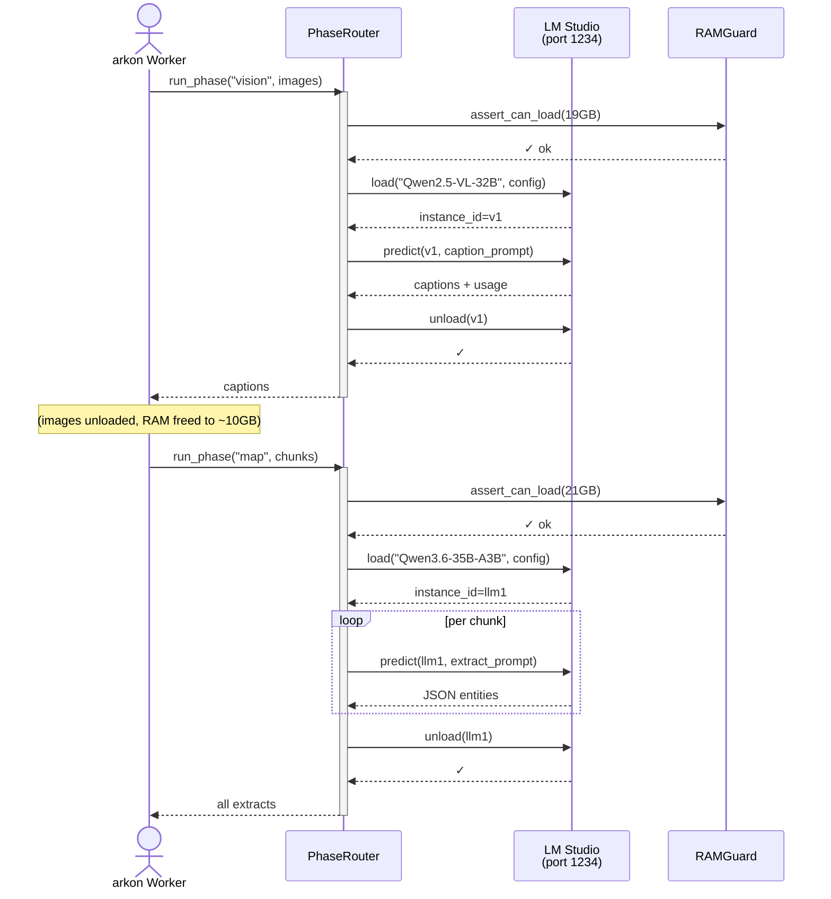

# Local AI Orchestrator

## Overview

The Local AI Orchestrator (`app/ai/local_orchestrator/`) is an independent module managing on-premise LLM inference via LM Studio on M1 Max (32GB unified memory). It orchestrates three models (vision, main LLM, embedding) in a sequential cold-swap pattern, enabling arkon's MRP pipeline to run entirely locally without cloud API calls.

M1 Max constraints require careful RAM budgeting: vision peak ~20GB, main LLM peak ~21–22GB, embedding ~2GB (on-demand). The module implements pre-flight RAM checks, OOM auto-fallback to smaller models, and lazy-loading of the embedding service. Two user-facing modes control behavior: **`max`** (tuned defaults, advanced sampling, K/V quantization) and **`other`** (user-provided model IDs, baseline tuning only). Mode `off` disables local AI entirely—default state means zero impact on existing installs.

Configuration is KV-based (all keys prefixed `local_ai.*`): model IDs, context lengths, sampling profiles per phase, LMS connection details. The provider registry gates orchestrator activation—when `local_ai.mode != "off"`, the LocalOrchestratorProvider replaces cloud calls. A simple boolean: one KV change toggles on/off, no schema migrations required.

## Architecture Diagram



## Modes Comparison

| Aspect | `max` mode | `other` mode | `off` mode |
|--------|-----------|--------------|-----------|
| **Use case** | Preset tuning; production-ready | Custom models; experimentation | Legacy cloud LLM |
| **Model IDs** | Defaults: Qwen3.6, Qwen2.5-VL, gte-Qwen2 | User must set per phase | Ignored |
| **Context length override** | ✓ Applied per phase | ✗ LM Studio defaults | N/A |
| **Eval batch size** | ✓ Applied (256 for main LLM) | ✗ Defaults | N/A |
| **Flash attention** | ✓ On | ✗ Off | N/A |
| **K/V cache offload** | ✓ On | ✗ Off | N/A |
| **Sampling per phase** | ✓ Researched temps (0.2–0.7) | ✓ Applied (existing arkon defaults) | ✓ Cloud LLM defaults |
| **Vietnamese system prompt** | ✓ Enforced | ✓ Enforced | Varies (cloud) |
| **Few-shot examples** | ✓ 2–3 per phase | ✗ Zero-shot | Varies |
| **Cold-swap sequence** | ✓ vision → main_llm → embedding | ✓ Same | N/A |
| **Admin UI tuning visible** | ✓ Advanced fields shown | ✗ Only model_id fields | N/A |

**Recommendation:** Start with `max` mode for standard deployments. Use `other` for model A/B testing or custom LoRA variants. Leave `off` only for cloud-only environments.

## Module Layout

```
app/ai/local_orchestrator/
├── __init__.py                          # Module exports + entry point
├── config.py                            # Pydantic schemas for all KV configs
├── presets.py                           # MAX_PRESET dict (HF model IDs, defaults)
├── lms_client.py                        # Abstract LMSClient interface
├── lms_client_rest.py                   # REST client wrapping `lmstudio` SDK v1.5+
├── lms_client_guarded.py                # Async lock + inflight request tracking
├── ram_guard.py                         # Pre-flight memory check (psutil)
├── phase_router.py                      # State machine: which model loaded now?
├── provider_adapter.py                  # Replaces cloud provider when local_ai.mode != off
├── embedding_service.py                 # Lazy-load sentence-transformers (not LM Studio)
├── sampling_profiles.py                 # Per-phase temperature/top_p/top_k/min_p sets
└── prompt_templates/
    ├── __init__.py
    ├── universal_system_vi.py           # Shared Vietnamese system prompt
    ├── map_extract.py                   # MAP: JSON entity extraction
    ├── reduce_plan.py                   # REDUCE: wiki structure outline
    ├── refine_write.py                  # REFINE: long-form page writing
    ├── verify_check.py                  # VERIFY: citation + coverage audit
    ├── digest_summary.py                # DIGEST: multi-page rollup
    ├── vision_caption.py                # Vision: image description
    └── few_shot_examples.py             # Shared examples for all phases
```

## Configuration Reference

All configuration keys are stored in the `app_config` KV table with prefix `local_ai.`. The alembic seed migration (029) initializes all keys to `MAX_PRESET` defaults. Update via admin UI (`/admin/local-ai`) or direct SQL `UPDATE app_config SET value = ...`.

### Connection

| Key | Type | Default | Description |
|-----|------|---------|-------------|
| `local_ai.mode` | str | `off` | Activation: `off` \| `max` \| `other` |
| `local_ai.lms_host` | str | `http://host.docker.internal:1234` | LM Studio API base URL |
| `local_ai.lms_auth_token` | str | (empty) | Bearer token for auth; empty = no auth for localhost |

### Vision Phase

| Key | Type | Default (max) | Description |
|-----|------|---------------|-------------|
| `local_ai.vision.model_id` | str | `mlx-community/Qwen2.5-VL-32B-Instruct-4bit` | HF repo ID for vision model |
| `local_ai.vision.fallback_model_id` | str | `mlx-community/Qwen2.5-VL-7B-Instruct-8bit` | Fallback if OOM |
| `local_ai.vision.estimated_ram_gb` | float | `19.0` | Peak RAM needed to load |
| `local_ai.vision.context_length` | int | `8192` | Max input tokens (images + caption prompt) |
| `local_ai.vision.eval_batch_size` | int | `16` | Batch size for parallel image processing |
| `local_ai.vision.gpu_ratio` | float | `1.0` | GPU memory ratio (1.0 = 100%) |

### Main LLM Phase

| Key | Type | Default (max) | Description |
|-----|------|---------------|-------------|
| `local_ai.main_llm.model_id` | str | `mlx-community/Qwen3.6-35B-A3B-4bit-DWQ` | HF repo ID for main LLM (requires HF verification) |
| `local_ai.main_llm.fallback_model_id` | str | `mlx-community/Qwen3-32B-Instruct-4bit` | Fallback if OOM or primary unavailable |
| `local_ai.main_llm.estimated_ram_gb` | float | `21.0` | Peak RAM at 32k context + KV cache |
| `local_ai.main_llm.context_length` | int | `32768` | Max input tokens (long-form MRP tasks) |
| `local_ai.main_llm.eval_batch_size` | int | `256` | Token batch size for parallel generation |
| `local_ai.main_llm.gpu_ratio` | float | `1.0` | GPU memory ratio |
| `local_ai.main_llm.flash_attention` | bool | `true` | Enable flash attention (faster, lower mem) |
| `local_ai.main_llm.kv_cache_offload` | bool | `true` | Offload KV cache to disk if needed |

### Embedding Phase

| Key | Type | Default (max) | Description |
|-----|------|---------------|-------------|
| `local_ai.embedding.model_id` | str | `Alibaba-NLP/gte-Qwen2-1.5B-instruct` | HF repo for embedding (runs in Python, not LM Studio) |
| `local_ai.embedding.fallback_model_id` | str | `Alibaba-NLP/gte-multilingual-base` | Fallback if primary slow |
| `local_ai.embedding.estimated_ram_gb` | float | `2.0` | Peak RAM when loaded (lazy-loaded on demand) |

### Sampling Profiles (max mode only)

Per-phase sampling applied by the orchestrator. Format: single JSON object per key.

| Key | Default | Purpose |
|-----|---------|---------|
| `local_ai.sampling.map` | `{"temperature": 0.2, "top_p": 0.9, "top_k": 40, "min_p": 0.05}` | Low temp for deterministic entity extraction |
| `local_ai.sampling.reduce` | `{"temperature": 0.3, "top_p": 0.9, "top_k": 40, "min_p": 0.05}` | Moderate temp for outline planning |
| `local_ai.sampling.refine` | `{"temperature": 0.7, "top_p": 0.9, "top_k": 40, "min_p": 0.05, "repeat_penalty": 1.1}` | High temp for creative wiki writing |
| `local_ai.sampling.verify` | `{"temperature": 0.2, "top_p": 0.9, "top_k": 40, "min_p": 0.05}` | Near-deterministic audit |
| `local_ai.sampling.digest` | `{"temperature": 0.5, "top_p": 0.9, "top_k": 40, "min_p": 0.05}` | Moderate temp for rollup summary |
| `local_ai.sampling.vision` | `{"temperature": 0.2, "top_p": 0.9}` | Low temp for accurate image captions |

### RAM and Fallback

| Key | Type | Default | Description |
|-----|------|---------|-------------|
| `local_ai.ram_headroom_gb` | float | `2.0` | Safety buffer subtracted from free RAM; prevents OOM by underestimation |
| `local_ai.ooms_to_fallback_threshold` | int | `2` | After N consecutive OOM errors, auto-switch to fallback_model_id |

## Provider Adapter Integration

The module provides a `LocalOrchestratorProvider` class that plugs into arkon's provider registry (used by `app/ai/mrp/`). The integration is passive until activated:

```python
# In app/ai/providers/__init__.py or similar registry:
if config.get("local_ai.mode") != "off":
    register_provider(LocalOrchestratorProvider())
```

When `local_ai.mode` is active, any call to `llm.generate()` or `llm.embed()` routes through the orchestrator's phase router, which:
1. Checks available RAM via `RAMGuard`
2. Loads the required model into LM Studio
3. Sends prompt to the loaded instance
4. Unloads the model (or keeps it warm if next phase uses same model)
5. Returns completion

No code in MRP pipeline changes—provider swapping is transparent.

## Troubleshooting

### 1. "LM Studio connection refused" (port 1234 not reachable)

**Symptoms:** Admin `/local-ai` shows red X on connection test; worker logs show `ConnectionError: refused`.

**Fix:**
- Verify LM Studio is running: `curl http://localhost:1234/api/v1/models` should return JSON
- If using Docker, ensure `LMS_HOST` env var = `http://host.docker.internal:1234` on macOS / Linux
- On macOS, Docker Desktop requires explicit setting: Settings → Resources → File Sharing (if on custom mount)
- Check firewall: `sudo lsof -i :1234` should show LM Studio process listening

### 2. "Out of Memory" (OOM) during vision phase

**Symptoms:** Worker task fails; logs show `RAMInsufficientError: need 19GB + 2GB headroom, but only 15GB available`.

**Fix:**
- Close unnecessary apps (Chrome, IDE, etc.)
- Run `vm_stat 1 5` (macOS) or `free -h` (Linux) to verify free RAM
- If persistent, the config's `vision.estimated_ram_gb` may be underestimated. Increase by 1GB and retry
- Automatic fallback: after 2 consecutive OOMs, module switches to `vision.fallback_model_id` (Qwen2.5-VL-7B, ~14GB)

### 3. "Model not found" on load

**Symptoms:** Logs show `ModelNotFoundError: mlx-community/Qwen3.6-35B-A3B-4bit-DWQ not in LM Studio library`.

**Fix:**
- Download the model in LM Studio UI: Models → Search → paste repo ID → Download
- Verify the exact HF repo name: `mlx-community/Qwen3.6-35B-A3B-4bit-DWQ` (exact case and dashes matter)
- If repo doesn't exist on HF, fall back to the known-good `mlx-community/Qwen3-32B-Instruct-4bit`
- Edit `local_ai.main_llm.model_id` via admin UI → Save

### 4. "K/V cache quantization not applied" (slow inference)

**Symptoms:** Main LLM inference is slow (~10 tok/s); expected ~50 tok/s; no K/V quant in LM Studio UI for the model.

**Fix:**
- K/V cache q8_0 quantization **must be set manually in LM Studio UI per model**—it is not exposed via SDK
- In LM Studio: My Models → right-click Qwen3.6-35B → Model Config → Advanced → K/V Cache Type → select `q8_0`
- Repeat for all 3 models (vision, main_llm, embedding if using LM Studio for it)
- Restart LM Studio server after saving configs
- Estimated speedup: ~15–20% with q8_0; see [LM Studio release notes](https://github.com/lmstudio-ai/lmstudio-community-releases) for MLX quantization details

### 5. "Embedding service crashes" (import error for sentence-transformers)

**Symptoms:** Worker logs show `ModuleNotFoundError: No module named 'sentence_transformers'` during REFINE phase retrieval.

**Fix:**
- Embedding service uses `sentence-transformers` library (NOT LM Studio)—install via `pip install sentence-transformers`
- If using Docker, rebuild image: `docker build --no-cache -t arkon .` to re-run pip install
- Verify: `python -c "from sentence_transformers import SentenceTransformer; print('OK')"`

### 6. "Phase router stuck loading" (timeout after 600s)

**Symptoms:** Worker task hangs for > 10 min; logs show `LMSClient.load(...) timeout after 600s`.

**Fix:**
- LM Studio may be frozen or processing large model. Restart LM Studio: `killall -9 LMStudio` or use GUI
- Check if another process is loading a model: `lms ls` shows what's loaded
- If model is oversized (>30GB), machine does not have enough RAM; reduce eval_batch_size or switch to fallback model

### 7. "Connection works but inference quality is poor"

**Symptoms:** Generated text contains hallucinations, poor Vietnamese formatting, or off-topic responses.

**Fix:**
- Verify mode is `max`: admin UI → Mode should show "Max (tuned)"
- Check sampling profiles are applied: logs should show `sampling.refine.temperature=0.7` for REFINE phase
- Ensure system prompt is correct: prompt_templates/universal_system_vi.py should be up-to-date (Vietnamese formatting rules)
- If using `other` mode, sampling defaults may be loose—switch to `max` for production

### 8. "Admin page shows "Initializing…" forever"

**Symptoms:** `/admin/local-ai` page loads but spinner never stops; no mode selector visible.

**Fix:**
- DB seed migration (029) may not have run. Check: `psql -c "SELECT COUNT(*) FROM app_config WHERE key LIKE 'local_ai.%'"`
- If result is 0, apply migration: `alembic upgrade head`
- Refresh browser (Ctrl+Shift+R) to clear cache

### 9. "Fallback model triggered but quality degraded"

**Symptoms:** Mode shows "Max (fallback active)" in admin; output quality is noticeably worse.

**Fix:**
- Fallback was auto-triggered after 2 OOMs, usually indicating RAM pressure
- Primary issue: insufficient free RAM at task start. Close apps, restart services, increase `ram_headroom_gb`
- Verify fallback model is tuned: `mlx-community/Qwen3-32B-Instruct-4bit` is dense 32B, not as good as Qwen3.6 MoE
- To resume max mode: admin UI → save config with `local_ai.main_llm.model_id` pointing back to Qwen3.6

### 10. "Docker container cannot reach host LM Studio" (on Linux)

**Symptoms:** Container logs show `ConnectionError: http://host.docker.internal:1234 refused`; host can reach LM Studio directly.

**Fix:**
- Linux doesn't support `host.docker.internal` like macOS/Windows. Use host IP: `docker run --add-host=host.docker.internal:host-gateway arkon`
- Or pass LMS_HOST explicitly: `docker run -e LMS_HOST=http://<host-ip>:1234 arkon`
- Ensure firewall allows container network: `iptables -I DOCKER-USER -i eth0 -d 172.17.0.0/16 -j ACCEPT` (adjust for your docker subnet)

## FAQ

### Why not just use Ollama?

Ollama is simpler for single-model serving but lacks fine-grained model lifecycle control. The orchestrator's cold-swap pattern requires **loading model A, using it for vision, then unloading it completely before loading model B for main LLM**. Ollama's model management is single-model-at-a-time and doesn't expose RAM per-model, making pre-flight checks difficult. LM Studio SDK + REST API gives precise load/unload control and health monitoring, critical for M1 Max's tight 32GB budget.

### Why sentence-transformers embedding instead of LM Studio?

LM Studio exposes inference but not task-specific prompting (e.g., `prompt_name="search_query"` vs `"document"`). sentence-transformers library supports the full `task_type` parameter needed for retrieval-aware embeddings (gte-Qwen2 trained with task prefixes). Running embedding in-process (Python) also saves a model slot in LM Studio, leaving it free for vision + main LLM.

### How do I add a 4th phase or custom model?

1. **New phase:** add a row to `local_ai.sampling.<new_phase>` KV (e.g., `local_ai.sampling.custom_analysis`) with JSON sampling config
2. **In prompt_templates/:** create `new_phase.py` with your prompt engineering
3. **In phase_router.py:** add a new branch in the state machine to load the right model and apply the prompt
4. **Registry:** ensure provider adapter routes the new phase call to the orchestrator
5. Test thoroughly with `other` mode first (user-provided model for that phase)

### What if my machine has <32GB RAM?

The orchestrator's models target M1 Max 32GB. For smaller machines:
- **24GB:** Replace main LLM with fallback (Qwen3-32B dense, ~18GB) or use `other` mode with a smaller model (Qwen2-7B)
- **16GB:** Use vision fallback (Qwen2.5-VL-7B, ~14GB) + smaller main LLM; embedding on-demand only
- **≤8GB:** Disable local AI (`mode=off`); local orchestrator is not viable
Monitor Activity Monitor or `vm_stat` during task runs. If consistently hitting swap, increase `ram_headroom_gb` to trigger fallback sooner.

### Can I run cloud LLM + local vision simultaneously?

Yes, the phases are independent. Set:
- `local_ai.mode = "other"`
- `local_ai.vision.model_id = "mlx-community/Qwen2.5-VL-32B-Instruct-4bit"` (local vision)
- `local_ai.main_llm.model_id = ""` (empty = skip local; use cloud provider)
The provider adapter will route vision to local orchestrator and main LLM calls to cloud. Useful for hybrid deployments.

## References

- **Design Document:** [Local AI Orchestrator Design](../plans/reports/brainstorm-260524-2217-local-ai-orchestrator-module-design.md)
- **Plan Overview:** [Phase Plan](../plans/260524-2217-local-ai-orchestrator/plan.md)
- **Model Checklist:** [Model Setup & LM Studio Configuration](./local-ai-model-checklist.md)
- **Migration Playbook:** [Production Cutover Guide](./local-ai-migration-playbook.md)
- **Related:** [ARCHITECTURE.md](./ARCHITECTURE.md) (system context), [mrp-ops.md](./mrp-ops.md) (MRP operations)
- **HF Models:** [mlx-community/Qwen3.6-35B-A3B-4bit-DWQ](https://huggingface.co/mlx-community/Qwen3.6-35B-A3B-4bit-DWQ), [mlx-community/Qwen2.5-VL-32B-Instruct-4bit](https://huggingface.co/mlx-community/Qwen2.5-VL-32B-Instruct-4bit), [Alibaba-NLP/gte-Qwen2-1.5B-instruct](https://huggingface.co/Alibaba-NLP/gte-Qwen2-1.5B-instruct)
